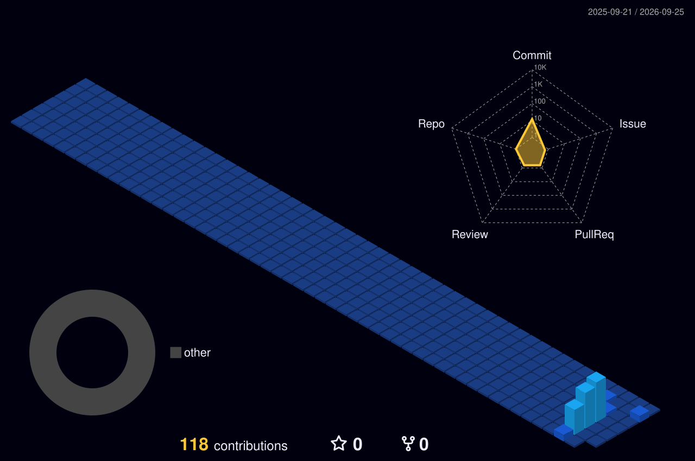

  
  
  <h1>Bem-vindo, eu sou o Guilherme Silva! 🖐</h1>
  <h3>Estudante de Engenharia de Software | UniBras</h3>
  
Esse é o meu GitHub, focado em projetos reais e desenvolvimento de sistemas avulsos!

---

## 🚀 Sobre Mim

- 🎓 Estudante de Engenharia de Software na **UniBras Montes Belos**.
- 💻 Meu foco atual é no desenvolvimento com **Python**, automação com **n8n** e criação com **Lovable**.
- 🌱 Tenho conhecimentos iniciais em **HTML** e **JavaScript**, e atualmente estou dedicando meus estudos para aprender **TypeScript**.
- 🤖 Conto com a colaboração da minha IA para estruturar códigos, planejar rotinas de estudos e otimizar projetos.
- 🎯 Busco evolução em desenvolvimento de software e conhecimento humano para conseguir ser um concursado de TI com estabilidade.

---

## 🛠️ Tecnologias e Ferramentas

  
  
  
  
  

---

## 📊 Estatísticas e Contribuições do Ano

  

  
  

  

---

## 📫 Contato e Redes Sociais

  
  
  
  

